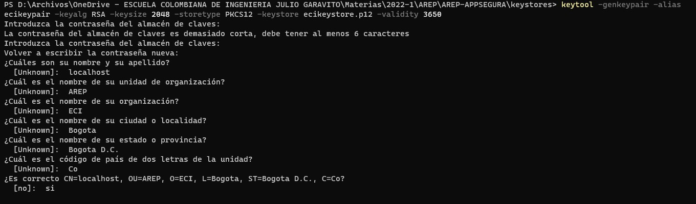
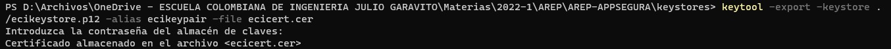
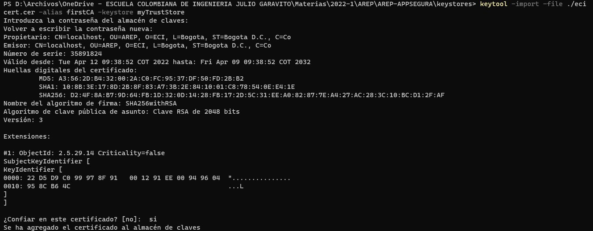
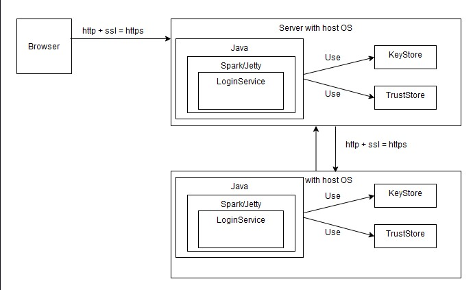

# APLICACIÓN DISTRIBUIDA SEGURA EN TODOS SUS FRENTES

La intension de este proyecto fue la implemntacion de certificados de seguridad para poder acceder a cada uno de estos servicios. En este caso se esta usando keytool para crear los certificados, en este caso para poder hacer esto lo hacemos por medio del comando. 
```
keytool -genkeypair -alias ecikeypair -keyalg RSA -keysize 2048 -storetype PKCS12 -keystore ecikeystore.p12 -validity 3650
```

Recuerde que este se guarda donde usted se encuentra parado en ese comento.

- Para poder exportar el certificado se usa el comando 
```
keytool -export -keystore ./ecikeystore.p12 -alias ecikeypair -file ecicert.cer
```

- Para poder exportar el certificado a TrustStore
```
keytool -import -file ./ecicert.cer -alias firstCA -keystore myTrustStore
```


## Arquitectura 



## Como desplegar el proyecto
### Local
Para poder usar este proyecto primero que todo lo debemos hacer de forma local

1. Se clonara el proyecto por medio del comando 
```
git clone https://github.com/jua1000n/AREP-APPSEGURA
```
2. Despues debemos abrir la consola de comandos. y debemos pararnos donde se encuentre la carpeta del proyecto para ejecutar el comando
```
mvn clean install
```
3. Despues podremos ejecutar el proyecto, en este caso para esto se debe tener en cuenta que las URLS de los servidores deben ser modificadas, en este caso se encuentran dentro del archivo login.js
en este caso la primera url es
```
https://localhost:4567
```
la segunda es
```
https://localhost:5000
```
4. Ahora que se modifico eso debemos ejecutar el comando del paso 1 nuevamente para verificar que compile de forma correcta todavia
5. ahora en la consola se debe ejecutar estos dos comandos para poner a correr ambos servicios(si le manda un error diciendo que no encuentra la clase main cambie el ; por un :)
```
java -cp "target/classes;target/dependency/*" App
java -cp "target/classes;target/dependency/*" SecondService
```
Ahora que ya ejecuto estos dos puede ir al navegador para probarlo, debe ingresar con la primera url dada, el usuario valio es 
user: juan, 
password: cadavid

### AWS
1. Debe crear las dos instancias de EC2 y en los grupos de seguridad en este caso se le debe dar permiso a los puertos 4567 y 5000
2. Se instalara java y unzip, con el comando
```
sudo yum install java
sudo yum install unzip
```
3. Una vez echo esto el proyecto que se utilizo en la parte local, se debe reemplazar las URLS anteriormente reemplazadas para la forma local, se deben reemplazar con las de las instancias EC2(Recuerde siempre compilar despues de haber echo algun cambio en el codigo)
4. Ahora se ingresara por medio sftp, para cargar el archivo, en este caso el proyecto anterior se debe convertir a un zip, ya que estamos haciendo la conexion por medio de ssh debemos reemplazar ssh por sftp, una vez dentro se colocara el comando
```
put AREP-APPSEGURA.zip
```
y despues nos volvemos a conectar por medio de ssh a las instancias
5. Una vez ya dentro de nuevo se ejecuta el comando(recordar que los pasos anteriormente echos se deben hacer en ambas instancias)
```
unzip AREP-APPSEGURA.zip
```
6. Nos ubicamos dentro de la carpeta del proyecto y en una de las instancias ejecutamos el comando(debe tener en cuenta que esto depende en que instancia usted decidio ejecutar la de App y en cual la se SecondService, esto usted lo decidio en el paso 3, y recordar que si no le sirve reemplace el ; por :)
```
java -cp "target/classes;target/dependency/*" App
```
y en la otra 
```
java -cp "target/classes;target/dependency/*" SecondService
```

## Autor
Juan Cadavid
